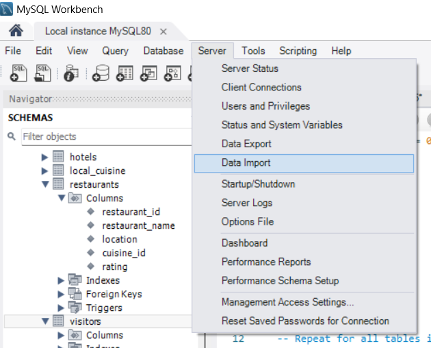

# Welcome to SQLRevival: Sicily Edition! :hugs: :beach_umbrella:


## Introduction:

Are you ready to dust off your SQL skills and dive back into the world of databases? Whether you're a seasoned SQL pro or someone who hasn't touched SQL in years, this repository is your gateway to rekindling your passion for querying data. This repository is designed to provide a hands-on refresher on SQL through a series of exercises focused on managing bookings and visits in the beautiful island of Sicily! :desert_island:

## About the Database:
Our database revolves around bookings and visits to various attractions in Sicily. From enchanting coastal towns to historic landmarks, Sicily offers a myriad of attractions for travelers. The database schema encompasses tables for attractions, bookings, visitors, and more, providing a comprehensive dataset for practicing SQL queries.

## Goals:
The primary goal of this repository is to help users reacquaint themselves with SQL by engaging in practical exercises. By working through queries tailored to Sicily bookings and visits, users can reinforce their understanding of SQL fundamentals and gain confidence in querying databases.

## What to Expect:
Within this repository, you'll find a series of SQL exercises ranging from basic to advanced levels. Each exercise is accompanied by clear instructions, sample data, and expected outcomes, allowing for a structured and progressive learning experience. Whether you're refreshing your memory or exploring new SQL concepts, these exercises will provide valuable practice opportunities.

## Contributions:
We welcome contributions from SQL enthusiasts of all levels! If you have additional exercises, improvements to existing ones, or suggestions for enhancing the learning experience, feel free to submit pull requests. Together, we can create a valuable resource for SQL learners seeking to brush up on their skills.

Let's Get Started:
Whether you're a seasoned SQL pro or a newcomer looking to learn, dive into the exercises and start revitalizing your SQL proficiency with SQLRevival_SicilyBookings! Happy querying!

## Content inside the repository
- `schema.sql`: contains the schema definition for the database, including tables, columns, data types, constraints, and relationships. In particular there are 8 tables
- `data.sql`: contains data insertion statements that populate the tables defined in the schema.
- `delete_all_data_from_tables.sql`: an SQL script that allows to delete all the data from the tables, in case you need it

## Tables Overview

### Attractions Table
| Column Name     | Data Type |
|-----------------|-----------|
| attraction_id   | INT       |
| attraction_name | TEXT      |
| attraction_type | TEXT      |
| description     | TEXT      |
| location        | TEXT      |
| opening_hours   | TEXT      |
| entrance_fee    | FLOAT     |
| rating          | FLOAT     |

### Visitors Table
| Column Name | Data Type |
|-------------|-----------|
| visitor_id  | INT       |
| first_name  | TEXT      |
| last_name   | TEXT      |
| email       | TEXT      |
| nationality | TEXT      |

### Visits Table
| Column Name   | Data Type |
|---------------|-----------|
| visit_id      | INT       |
| visitor_id    | INT       |
| attraction_id | INT       |
| visit_date    | DATE      |

### Hotels Table
| Column Name  | Data Type |
|--------------|-----------|
| hotel_id     | INT       |
| hotel_name   | TEXT      |
| location     | TEXT      |
| rating       | FLOAT     |
| price_range  | TEXT      |

### Bookings Table
| Column Name    | Data Type |
|----------------|-----------|
| booking_id     | INT       |
| visitor_id     | INT       |
| hotel_id       | INT       |
| check_in_date  | DATE      |
| check_out_date | DATE      |
| price          | FLOAT     |

### Local Cuisine Table
| Column Name  | Data Type |
|--------------|-----------|
| cuisine_id   | INT       |
| cuisine_name | TEXT      |
| description  | TEXT      |

### Restaurants Table
| Column Name   | Data Type |
|---------------|-----------|
| restaurant_id | INT       |
| restaurant_name | TEXT    |
| location      | TEXT      |
| cuisine_id    | INT       |
| rating        | FLOAT     |

### Events Table
| Column Name | Data Type |
|-------------|-----------|
| event_id    | INT       |
| event_name  | TEXT      |
| location    | TEXT      |
| date        | DATE      |
| description | TEXT      |

## Setup
In case you don't have MySQL Server and MySQL Workbench installed, if you have Windows follow this guide:

[A Step-by-Step Guide to Installing MySQL and MySQL Workbench on Windows](https://arvideichner.medium.com/a-step-by-step-guide-to-installing-mysql-and-mysql-workbench-on-windows-c4f2e9e37fb8)

Once you have everything installed and you have launched MySQL Workbench, open a connection and then we need to import the schema and populate the tables.

Go to "Server" > "Data Import"



Then, specify the path where the `schema.sql` is located and then click "Start Import"


After the schema has been imported, go back to the tab "Import from Disk" on top and do the same steps with `data.sql`.


# Queries

###### Query 1:
Retrieve the names and descriptions of all attractions located in Palermo.

<details>
<summary>Solution</summary>

```sql
SELECT attraction_name, description
FROM attractions
WHERE location = "Palermo"
```
</details>

###### Query 2:
Find the average rating of attractions in each type.

<details>
<summary>Solution</summary>

```sql
SELECT avg(rating) as average_rating
FROM attractions
GROUP BY attraction_type
```
</details>

###### Query 3:
List the top 3 attractions with the highest entrance fee.

<details>
<summary>Solution</summary>
 
```sql
SELECT * FROM attractions
ORDER BY entrance_fee DESC
LIMIT 3
```
</details>

###### Query 4:
Count the number of visitors from each nationality.

<details>
<summary>Solution</summary>
 
```sql
SELECT nationality, COUNT(*) as num_visitors
FROM visitors
GROUP BY nationality
```
</details>

###### Query 5:
Calculate the total number of visits for each attraction.

<details>
<summary>Solution</summary>
 
```sql
SELECT attraction_id, COUNT(*) as num_visits
FROM visits
GROUP BY attraction_id
```
</details>

###### Query 6:
Identify the attractions that have not been visited by any visitors.

<details>
<summary>Solution</summary>
 
```sql
SELECT * FROM attractions
WHERE attraction_id NOT IN (SELECT attraction_id FROM visits)
```
</details>

###### Query 7:
Find the hotels with a rating higher than 8 and located in Catania.

<details>
<summary>Solution</summary>
 
```sql
SELECT * FROM hotels
WHERE rating > 8 AND location = "Catania"
```
</details>

###### Query 8:
List the visitors who have booked hotels in Palermo.

<details>
<summary>Solution</summary>
 
```sql
SELECT V.* FROM visitors V, bookings B, hotels H
WHERE V.visitor_id = B.visitor_id
AND B.hotel_id = H.hotel_id
AND B.hotel_id IN (SELECT hotel_id FROM hotels WHERE location = "Palermo")
```
</details>

###### Query 9:
Calculate the total revenue generated from hotel bookings.

<details>
<summary>Solution</summary>
 
```sql
SELECT SUM(price) as total_revenue
FROM bookings
```
</details>

###### Query 10:
Find the cuisine with the most restaurants offering it.

<details>
<summary>Solution</summary>
 
```sql
SELECT C.*, COUNT(*) as num_restaurants_offering
FROM restaurants R, local_cuisine C
WHERE R.cuisine_id = C.cuisine_id
GROUP BY C.cuisine_id
ORDER BY COUNT(*) DESC
LIMIT 1
```
</details>

###### Query 11:
Calculate the average rating of attractions visited by visitors from each nationality.

<details>
<summary>Solution</summary>
 
```sql
SELECT VTORS.nationality, avg(A.rating) as average_rating
FROM attractions A, visitors VTORS, visits VS
WHERE A.attraction_id = VS.attraction_id AND VS.visitor_id = VTORS.visitor_id
GROUP BY VTORS.nationality
```
</details>

###### Query 12:
Identify the events happening in July 2024.

<details>
<summary>Solution</summary>
 
```sql
SELECT * FROM events
WHERE MONTH(date) = 7 AND YEAR(date) = 2024
```
</details>

###### Query 13:

Find the visitors who have visited more than 3 attractions in a single day.

<details>
<summary>Solution</summary>
 
```sql
SELECT V.*, COUNT(DISTINCT VI.attraction_id) as num_attractions_visited
FROM visitors V, visits VI
WHERE V.visitor_id = VI.visitor_id
GROUP BY V.visitor_id, V.first_name, V.last_name, VI.visit_date
HAVING num_attractions_visited > 3
```
</details>

###### Query 14:
List the attractions that have been visited by visitors from at least 3 different nationalities.

<details>
<summary>Solution</summary>
 
```sql
SELECT A.*, COUNT(DISTINCT V.nationality) as num_visitors_nationalities
FROM attractions A, visitors V, visits VI
WHERE VI.visitor_id = V.visitor_id AND A.attraction_id = VI.attraction_id
GROUP BY A.attraction_id, A.attraction_name, A.attraction_type, A.description, A.location, A.opening_hours, A.entrance_fee, A.rating # without V.nationality
HAVING num_visitors_nationalities >= 3
```
</details>

###### Query 15:
Find the visitors who have visited both attractions located in Palermo and Catania.

<details>
<summary>Solution #1</summary>
 
```sql
(SELECT V.*
FROM visitors V, visits VI, attractions A
WHERE V.visitor_id = VI.visitor_id
AND VI.attraction_id IN (SELECT attraction_id FROM attractions WHERE location = "Palermo"))
INTERSECT
(SELECT V.*
FROM visitors V, visits VI, attractions A
WHERE V.visitor_id = VI.visitor_id
AND VI.attraction_id IN (SELECT attraction_id FROM attractions WHERE location = "Catania"))
```
</details>

<details>
<summary>Solution #2</summary>
 
```sql
SELECT V.*
FROM visitors V
JOIN visits VI ON V.visitor_id = VI.visitor_id
JOIN attractions A ON VI.attraction_id = A.attraction_id
WHERE A.location = 'Palermo'
AND V.visitor_id IN (
    SELECT visitor_id
    FROM visits
    JOIN attractions ON visits.attraction_id = attractions.attraction_id
    WHERE location = 'Catania'
);
```
</details>

###### Query 16:
Calculate the average duration of stays for visitors from each nationality.

<details>
<summary>Solution</summary>
 
```sql
SELECT nationality, avg(DATEDIFF(check_out_date, check_in_date)) as average_duration_stays
FROM bookings B JOIN visitors V ON B.visitor_id = V.visitor_id
GROUP BY nationality
```
</details>

###### Query 17:
List the visitors who have not made any hotel bookings.

<details>
<summary>Solution</summary>
 
```sql
SELECT V.*
FROM visitors V
WHERE V.visitor_id NOT IN (SELECT visitor_id FROM bookings)
```
</details>

###### Query 18:
Find the busiest month in terms of the number of visits.

<details>
<summary>Solution</summary>
 
```sql
SELECT MONTH(VI.visit_date), COUNT(*) as num_visits
FROM visits VI
GROUP BY MONTH(VI.visit_date)
ORDER BY num_visits DESC
LIMIT 1
```
</details>

###### Query 19:
Identify the attractions that have not been visited in the last 6 months.

<details>
<summary>Solution</summary>
 
```sql
SELECT *
FROM attractions A LEFT JOIN visits VI
ON A.attraction_id = VI.attraction_id
WHERE Vi.visit_date IS NULL OR VI.visit_date < DATE_SUB(NOW(), INTERVAL 6 MONTH)
```
</details>